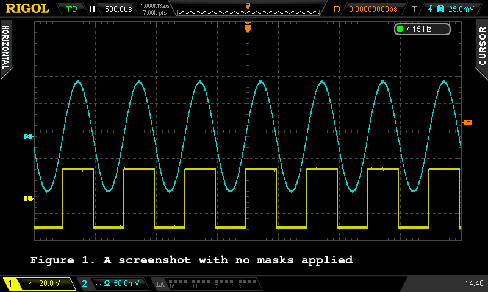
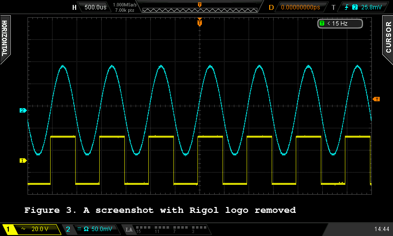

# Introduction

`scopemate.py` is a Python script designed to take a screenshot of an oscilloscope, specifically the Rigol DS2000 series instruments, and store it on a PC. The main purpose of this script is to simplify the process of capturing images of the oscilloscope's screen, which can be useful for documentation, analysis, or presentation.

The script can declutter the image by masking out left and right tabs, top left corner, and trigger frequency indicator - either separately or all at once. Instrument information (brand, model, serial number, and firmware version), as well as calibration date and time, can be saved in a text chunk of the screenshot image file. Additionally, a comment can be added on the screenshot and placed in a text chunk. 

# Installation

* clone the repo.
* (Optional but highly recommended) Install and activate a virtual environment.
* Install dependencies: `pip install pyvisa pyvisa-py pillow`
* Connect your instrument to the same subnet as your PC.
* Run `./scopemate.py -l`. If the instrument is reachable, its ID will be returned, which looks like: `TCPIP::<ip address>::INSTR`
* Run `./scopemate.py -i TCPIP::<ip address>::INSTR`. A screenshot of the specified instrument will be taken and saved into an image file named 'screenshot-<date,time>.png'.

# Basic Usage

* Run `./scopemate.py -l`. If the instrument is reachable, its ID will be returned. All other options will be silently ignored.
* Run `./scopemate.py -i TCPIP::<ip address>::INSTR`. A screenshot of the specified instrument will be taken and saved into an image file named 'screenshot-<date,time>.png'. If a different prefix is desired, it can be specified using the '-o' option.
* Run `./scopemate.py -i TCPIP::<ip address>::INSTR -m`. A screenshot will be taken, default mask applied, and the result will be saved into an image file named 'screenshot-<date,time>.png'. One or more masks can be explicitly specified following the '-m' flag.

Other useful options:

'-s' - Oscilloscope clock will be set to the current PC time. This is useful when keeping accurate time is important.

'-c' - Automatic measurement outputs at the bottom of the oscilloscope display will be turned off. This is useful if a comment is to be placed in this area.

'-C' - A comment will be added to the screenshot on the screen and in the text chunk of PNG file. The comment text can either follow the '-C' flag on the command line or be entered from the keyboard prompt.

'-S' - System info such as Manufacturer, mode, serial number, firmware version, last calibration date and time will be read from the instrument and placed in a text chunk of PNG file.
```
usage: scopemate.py [-h] (-l | -i INSTRUMENT) [-m [MASK ...]] [-o OUTPUT] [-s] [-c] [-C [COMMENT]] [-S]

options:
  -h, --help            show this help message and exit
  -l, --list            list available instruments
  -i INSTRUMENT, --instrument INSTRUMENT
                        instrument to query
  -m [MASK ...], --mask [MASK ...]
                        apply mask(s)
  -o OUTPUT, --output OUTPUT
                        output filename prefix
  -s, --synchronize     set instrument's date and time to PC time
  -c, --clean           turn off the automatic measurements output at the bottom of the display
  -C [COMMENT], --comment [COMMENT]
                        add comment to screenshot as well as text data to PNG file (max 60 chars). If empty, will prompt for input
  -S, --sysinfo         add system information as text data to PNG file
```
# Masks

Masks can be used to remove unnecessary elements of the display to make it look less cluttered. If desired, right and left tabs, Rigol logo at top left, and trigger frequency indicator can be masked out.

The following masks are provided:

* `empty.png` - A transparent image which can be used to create masks.
* `mask-default-blank.png` - A combination of all individual masks. It removes left and right tabs, top left corner, and trigger frequency indicator. This mask will be applied if '-m' flag is present but no filename is specified.
* `mask-left-right-top-blank.png` - Same as above with trigger frequency indicator left unmasked.
* `mask-left-tab.png`, `mask-right-tab.png`, `mask-top-left-blank.png`, `mask-trigger-freq.png` - Masks for single display areas. One or more can be specified with the '-m' flag.

# Further customization

The following constants at the top of scopemate.py file can be changed if desired.

```
DEFAULT_MASK = ['mask-default-blank.png']
COMMENT_FONT = "NimbusMonoPS-Bold.otf"
COMMENT_FONT_SIZE = 20
COMMENT_POSITION = (50, 420)
COMMENT_COLOR = (255, 255, 255)
MAX_COMMENT_LENGTH = 60
```
Modifying any other constants is not recommended.

# PNG text chunk

Information about the oscilloscope (manufacturer, model, serial number, firmware version, calibration date and time) can be saved in the text chunk of a screenshot image. An arbitrary comment text will also be saved (and printed on the screenshot). As of this writing, no PC application capable of reading the text chunk appears to exist. To view the data, use the `extract_comment.py` script.
```
usage: extract_comment.py [-h] files [files ...]

Extract text from PNG files created by scopemate

positional arguments:
  files       PNG file(s) to process. Accepts wildcards

options:
  -h, --help  show this help message and exit
```
Usage example:

user@host$ ./extract_comment.py fig*

figure-1.png:
Comment: Figure 1. A screenshot with no masks applied

figure-2.png:
Comment: Figure 2. A screenshot with default mask applied

figure-3.png:
Comment: Figure 3. A screenshot with Rigol logo removed

The images used in this example are included below for reference.




